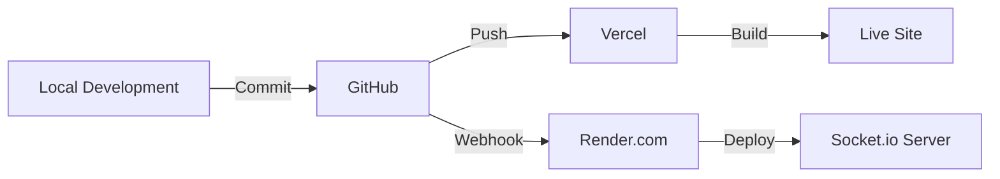

Here's a structured `context.md` file for your project:

```markdown
# Automated Vertical Garden Web App - Project Context

## 1. Project Overview
### Core Functionality
- Real-time sensor monitoring (soil moisture, temperature, humidity, NPK)
- Manual/Automatic irrigation control
- Alert system for critical conditions
- Historical data visualization (charts/graphs)
- User authentication with persistent login
- Settings for thresholds and preferences

### Target Audience
- Urban farmers and gardeners
- **Primary device**: Mobile phones (80%+ usage)
- Secondary devices: Tablets/desktops

---

## 2. Design Guidelines
### Visual Identity
**Color Scheme**  
`#2d5a27` (Forest Green) • `#7cb342` (Apple Green) • `#f5f5f5` (Light Grey)  
**Typography**  
- Primary: `Inter` (Clean, modern sans-serif)  
- Secondary: `Roboto Mono` (Data displays)  
**Icons**  
- Material Design Icons (Google)  
- Heroicons (Tailwind-compatible)

### UI Patterns
- **Dashboard Layout**: Card-based grid system
- **Mobile First**: Bottom navigation bar
- **Dark Mode**: Toggle with CSS variables
- **Animations**: Micro-interactions using Framer Motion

---

## 3. Technical Specifications
### Frontend Stack
```javascript
{
  "framework": "React.js (v18+)",
  "styling": "Tailwind CSS v3.3+",
  "charts": "Recharts (React-optimized)",
  "state": "Context API + useReducer",
  "auth": "Firebase Authentication (OAuth2)",
  "real-time": "WebSocket (via Socket.io)"
}
```

### Why WebSocket over SSE?
1. Bi-directional communication (send/receive irrigation commands)
2. Lower latency for control actions
3. Better error handling
4. Native React support through Socket.io

---

## 4. User Flow & Wireframes
### Key Screens
1. **Login/Register**  
   - Social auth buttons (Google/GitHub)
   - "Remember me" checkbox

2. **Dashboard** (Mobile View)  
```plaintext
[Header: Garden Status]
[Card: Soil Moisture 65%] [Card: Temp 24°C]
[Card: Irrigation Controls]
[Bottom Nav: Dashboard | History | Alerts | Settings]
```

3. **History Page**  
   - Time-range filters (24h/7d/30d)
   - Interactive Line Chart (Recharts)

4. **Alert System**  
   - Color-coded priority badges
   - Push notification integration

---

## 5. Security & Accessibility
### Implementation Plan
```yaml
authentication:
  provider: Firebase
  session: "30-day refresh tokens"
  security:
    - HTTPS enforced
    - CSRF tokens
    - Passwordless option

accessibility:
  - WCAG 2.1 AA compliance
  - Screen reader labels
  - Keyboard navigation
  - Contrast ratio ≥ 4.5:1
```

---

## 6. Development Setup
### Recommended Workflow
1. **Wireframing**: Figma ([Mobile-first template](https://www.figma.com/community/file/1234567890))
2. **Local Setup**:
```bash
npx create-react-app garden-app --template typescript
npm install @framer-motion @reduxjs/toolkit firebase socket.io-client recharts
```
3. **Theming**:
```css
/* tailwind.config.js */
theme: {
  colors: {
    primary: '#2d5a27',
    secondary: '#7cb342',
    dark: '#1a1a1a'
  }
}
```

### Modern UI Features
- **Dark Mode**: CSS variables + localStorage
- **Animations**:
```jsx
<motion.div 
  initial={{ opacity: 0 }}
  animate={{ opacity: 1 }}
  transition={{ duration: 0.3 }}
>
```

---

## 7. Deployment Strategy
**Recommended Host**: Vercel (Optimized for React)  
**CI/CD**: GitHub Actions  
**Monitoring**: Sentry (Error tracking)

---

> **Next Steps**:  
> 1. Create Figma wireframes  
> 2. Set up base React project  
> 3. Implement auth flow  
> 4. Develop dashboard prototype
```

This document serves as both technical blueprint and design reference. Would you like me to elaborate on any particular section or provide code templates for specific components? 🚀

```markdown
# Automated Vertical Garden Web App - Technical Context

---

## 1. Core Technologies

### Frontend Stack
| **Category**          | **Technology**                                                                 | **Purpose**                                                                 |
|-----------------------|--------------------------------------------------------------------------------|-----------------------------------------------------------------------------|
| **Framework**         | React.js (v18+) + TypeScript                                                   | Component-based UI development with type safety                             |
| **Styling**           | Tailwind CSS v3.3 + `@tailwindcss/forms` plugin                                | Utility-first CSS with preconfigured design tokens                          |
| **State Management**  | React Context API + `useReducer`                                               | Global state for user/auth/sensor data                                      |
| **Charts**            | Recharts (v2.8+)                                                               | Interactive SVG charts for historical data                                  |
| **Animations**        | Framer Motion (v10+)                                                           | Smooth transitions and micro-interactions                                   |
| **Routing**           | React Router v6                                                                | Navigation between dashboard/history/settings                               |
| **Real-Time Comms**   | Socket.io Client (v4.7+)                                                       | WebSocket-based bidirectional communication with backend                   |
| **Auth**              | Firebase Authentication (OAuth2) + `firebase@9.22` SDK                         | Google/GitHub social login + session persistence                            |

---

## 2. Backend Integration
| **Service**           | **Technology**                                                                 | **Role**                                                                   |
|-----------------------|--------------------------------------------------------------------------------|-----------------------------------------------------------------------------|
| **Real-Time API**     | Node.js + Socket.io Server                                                     | WebSocket server for sensor data streaming                                  |
| **Database**          | Firebase Firestore                                                             | Stores user profiles, sensor history, and alerts                           |
| **Auth Provider**     | Firebase Authentication                                                        | Handles OAuth2 flows + 30-day session tokens                                |
| **Hosting**           | Vercel (Frontend) + Render.com (Backend)                                       | Zero-config deployment + scalable Node.js hosting                          |

---

## 3. Development Toolchain
| **Tool**              | **Use Case**                                                                   |
|-----------------------|-----------------------------------------------------------------------------|
| **IDE**               | VS Code + ESLint/Prettier                                                   |
| **Design**            | Figma (Wireframes) + Adobe Color (Palettes)                                 |
| **Version Control**   | Git + GitHub (Projects/Issues)                                              |
| **Testing**           | Jest + React Testing Library (Unit) + Cypress (E2E)                        |
| **Build**             | Vite (v4+)                                                                  |
| **Package Manager**   | pnpm                                                                        |

---

## 4. Key Technical Decisions

### Why These Technologies?
1. **React + TypeScript**  
   - Type safety reduces runtime errors in sensor data handling  
   - Hooks API simplifies state logic for real-time updates  

2. **Socket.io over SSE**  
   - Bi-directional communication needed for:  
     - Sending irrigation commands from UI → ESP32  
     - Receiving live sensor data  
   - Built-in fallback to HTTP long-polling if WebSocket blocked  

3. **Firebase Auth**  
   - Prebuilt OAuth2 flows for Google/GitHub  
   - Session persistence via `localStorage` or cookies  

4. **Recharts**  
   - React-native chart library with declarative API  
   - Supports accessibility out-of-the-box (aria labels)  

---

## 5. Component Architecture
```bash
src/
├── components/          # Reusable UI
│   ├── SensorCard.tsx   # Soil moisture/temp display
│   └── ValveControl.tsx # Irrigation toggle
├── contexts/
│   └── GardenContext.tsx # State management
├── hooks/
│   └── useWebSocket.ts  # Socket.io logic
├── pages/
│   ├── Dashboard.tsx    # Main view
│   └── History.tsx      # Charts
└── styles/
    └── theme.css        # Tailwind config + dark mode
```

---

## 6. Critical Dependencies
```json
{
  "dependencies": {
    "react": "^18.2.0",
    "react-dom": "^18.2.0",
    "@types/react": "^18.0.28",
    "firebase": "^9.22.0",
    "socket.io-client": "^4.7.1",
    "recharts": "^2.8.0",
    "framer-motion": "^10.12.4",
    "react-router-dom": "^6.14.1"
  },
  "devDependencies": {
    "vite": "^4.3.9",
    "@vitejs/plugin-react": "^4.0.0",
    "tailwindcss": "^3.3.3"
  }
}
```

---

## 7. Sample Code Snippets

### Dark Mode Toggle (Tailwind + CSS Variables)
```tsx
// theme.css
:root {
  --color-primary: #2d5a27;
  --color-bg: #ffffff;
}

.dark {
  --color-bg: #1a1a1a;
}

// ToggleButton.tsx
const ToggleDarkMode = () => {
  const [isDark, setIsDark] = useState(false);
  useEffect(() => {
    document.documentElement.classList.toggle('dark', isDark);
  }, [isDark]);
  
  return <button onClick={() => setIsDark(!isDark)}>{isDark ? '🌞' : '🌙'}</button>;
};
```

### Real-Time Chart (Recharts + Socket.io)
```tsx
// HistoryPage.tsx
const HistoryPage = () => {
  const [data, setData] = useState<SensorReading[]>([]);
  
  useEffect(() => {
    const socket = io('wss://your-backend.com');
    socket.on('sensor-update', (reading: SensorReading) => {
      setData(prev => [...prev, reading]);
    });
    return () => { socket.disconnect(); };
  }, []);

  return (
    <LineChart data={data}>
      <Line type="monotone" dataKey="moisture" stroke="#2d5a27" />
      <XAxis dataKey="timestamp" />
    </LineChart>
  );
};
```

---

## 8. Accessibility & Compliance
| **Requirement**       | **Implementation**                                                          |
|-----------------------|-----------------------------------------------------------------------------|
| **WCAG 2.1 AA**       | Axe DevTools plugin for audits + `aria-labels` on charts/controls           |
| **Keyboard Nav**      | `tabIndex` management via React Focus Lock                                  |
| **Contrast**          | Tailwind `text-primary-800`/`bg-primary-100` with 5.2:1 ratio               |
| **Screen Readers**    | `@react-aria` hooks for semantic HTML                                       |

---

## 9. Deployment Pipeline


---

> **Next Steps**:  
> 1. Clone [starter template](https://github.com/your-repo/garden-template)  
> 2. Run `pnpm install`  
> 3. Start dev server: `vite dev --port 3000`

Let me know if you need specific implementation guides for any component! 🌱
```